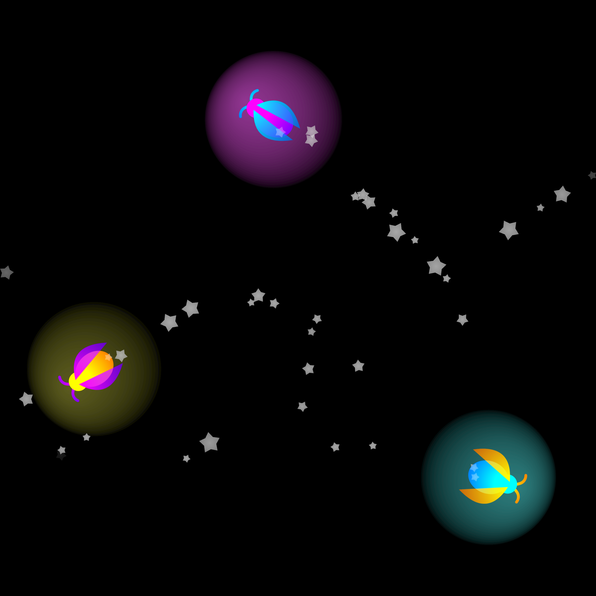

    <h1>Cat Game</h1>
    <i>May entertain one cat for one second.</i>

    <a href="https://ytt0.github.io/cat-game">
        
         
        ytt0.github.io/cat-game
    </a>

### Settings
- Set the screen brightness to maximum.
- On Android, enable vibration by increasing the *Notification Vibration Intensity* level (may cause jumpiness the first time).
- Try different speed and scale values to draw more attention.

 

The game is built as a single page application, and can be added from the browser menu as a local app in Android and Windows.

 

    

